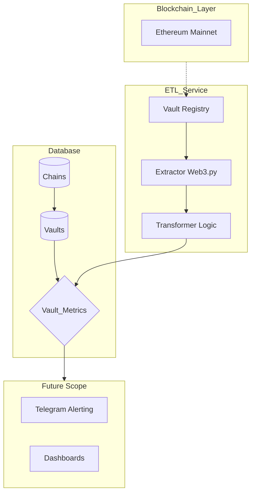

## Техническое задание: ETL-пайплайн для аналитики DeFi Vault

Создать автоматизированную систему для извлечения, преобразования и загрузки (ETL) данных из смарт-контрактов стандартов ERC-4626 / Proxy в реляционную базу данных для последующего финансового анализа 

### Схема БД 

1. **Таблица chain** (Справочник сетей)

| Поле     | Тип          | Описание                       |
|----------| -------------|--------------------------------|
| **id**       | SERIAL (PK)  | Уникальный ID сети             |
| name     | VARCHAR(50)  | Название (Ethereum, BSC, etc.) |
| chain_id | INTEGER      | ID сети (1 для Ethereum)       |
| rpc_url  | TEXT         | URL узла для этой сети         | 

2. **Таблица vault** (Справочник вольтов)

| Поле     | Тип          | Описание                       |
|----------| -------------|--------------------------------|
| **id**       | SERIAL (PK)  | Уникальный ID волта            |
| chain_id | INTEGER (FK) | Ссылка на таблицу chain        |
| address  | CHAR(42)     | Адрес прокси-контракта         |
| name     | VARCHAR(100) | Название                       | 

3. **Таблица Vault_Metrics**: Транзакционная таблица 

| Поле           | Тип          | Описание                       |
|----------      | -------------|--------------------------------|
| **id**             | SERIAL (PK)  | ID записи                      |
| vault_id       | INTEGER (FK) | Ссылка на таблицу vault        |
| timestamp      | TIMESTAMP    | Время записи                   |
| block_number   | BIGINT       | Номер блока (для точности)     | 
| tvl_assets     | NUMERIC      | TVL                            | 
| share_price    | NUMERIC      | Цена доли                      | 
| total_supply   | NUMERIC      | Общее кол-во долей             | 

### Требования к ETL-пайплайну 

#### 1. Этап Extraction (Извлечение)
Backfill Mode: Скрипт должен уметь проходить по историческим блокам с заданным шагом (например, каждые 10 000 блоков) начиная с deployment_block.

Real-time Mode: Сбор данных с последнего подтвержденного блока (latest) с заданным интервалом (например, каждые 5 минут).

Отказоустойчивость: Обработка ошибок RPC (timeout, rate limit) через механизмы повторных попыток (retries).

#### 2. Этап Transformation (Преобразование)
Нормализация: Приведение значений к формату float/decimal с учетом decimals токена.

Валидация: Проверка на zero supply во избежание ошибок деления при расчете цены доли.

#### 3. Этап Loading (Загрузка)
Использование SQLAlchemy ORM для обеспечения независимости от конкретной СУБД (поддержка PostgreSQL).

Контроль дубликатов по уникальному ключу (id).

### Схема пайплайна

